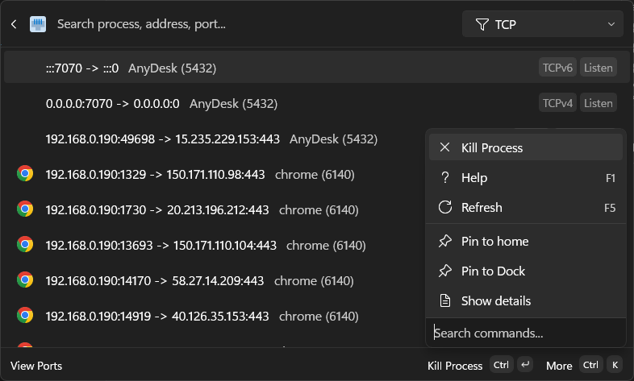

# Port for Command Palette

## Overview

This project provides a command palette extension for monitoring active network connections on Windows.



## Features
- **Port Monitoring**: Lists all active TCP and UDP ports (IPv4 and IPv6).
- **Intelligent Polling**: Automatically refreshes connection status when the page is visible and pauses when unfocused or hidden to conserve system resources.
- **Process Correlation**: Automatically maps network connections to their owning processes, including process name and file path.
- **Optimized for Performance**: Designed to remain fast and responsive, with efficient P/Invoke calls, process name caching, and list item caching.
- **Advanced Search**:
    - **Hybrid Search**: Uses fuzzy matching for process names and precise substring matching for IP addresses and ports.
    - **Customizable Filters**: Choose exactly which fields to search (Process Name, Local/Remote Address, Local/Remote Port) via settings.
- **Secondary Actions**: Access additional commands for each connection:
    - **Kill Process**: Terminate the process associated with a specific port.
    - **Open File Location**: Opens the location of the process executable in File Explorer.
    - **Refresh**: Manually reloads the list of active ports.

## Installation

### Via Command Palette

1. Open Command Palette
2. Select "Port for Command Palette"

### Via Winget

1. Open Command Prompt or PowerShell
2. Run the following command:
   ```bash
   winget install 15722UsefulApp.PortForCommandPalette
   ```

## How It Works

This extension utilizes native Windows APIs to discover active network endpoints:
- **IP Helper API**: Uses `GetExtendedTcpTable` and `GetExtendedUdpTable` from `iphlpapi.dll` to retrieve the current state of the network stack.
- **Stable Identifiers**: Generates unique IDs based on the Protocol, Local Address, and Local Port. This ensures that pinning works consistently across process restarts or even if a different application starts on the same port.
- **Process Enumeration**: Resolves Process IDs (PIDs) to human-readable names and file paths, with an internal cache to minimize overhead.

The results are presented as a dynamic list in the Command Palette, allowing for instant filtering and management of your system's network activity.

For more detailed technical information about the project's architecture and components, please see the [Project Guide](./GUIDE.md).

## Changelog

### 1.0.0.0
- **Search**: Implemented hybrid search (fuzzy for names, substring for addresses/ports) for better accuracy.
- **Settings**: Added toggles to enable/disable searching on specific fields (Process Name, Ports, Addresses).
- **Performance**: Added intelligent polling that starts/stops based on page visibility.
- **Performance**: Optimized process name resolution with caching to reduce CPU usage.
